#### 目錄
<a href="#mox">Mox Credit</a> 
<a href="#citi">Citi Rewards</a> 
<a href="#hsbc">HSBC Visa Gold</a> 
<a href="#aeon">Aeon Wakuwaku</a> 
<a href="#sc">SC Smart</a> 
<a href="#boc">BoC GBA Youth</a> 
<a href="#exc">查看即時匯率</a> 
  

##### Mox Credit

<table>
<tr>
<th colspan="3">任何商戶外幣交易（FCC)</th>
<td colspan="2">1% MC + .95% Bank</td>
</tr>
<tr>
<th colspan="3">海外商戶港幣交易（CBF)</th>
<td colspan="2">1% MC + .95% Bank</td>
</tr>
</table>
 

<table>
<tr>
<th>消費類別</th>
<th>回贈</th>
<th>限制</th>
<th>方式</th>
<th>結束日</th>
</tr>
<tr>
<td>超市</td>
<td>3%</td>
<td>無上限</td>
<td>不限</td>
<td>n/a</td>
</tr>

<tr>
<td colspan="5">馬莎百貨 一田 3hreeSixty PNS網購 Market Place HKTVmall city'super 惠康 TASTE 百佳超級市場 FUSION 更多場級市場...</td>
</tr>

<tr>
<td colspan="5">實測 包括： 1 Don Don Donki  不包括： 1 GreenPrice 綠惜超級市場</td>
</tr>
</table>

  
詳細T&C

	1. <a target="_blank" rel="noopener noreferrer" href="https://mox.com/zh/promotions/unlimitedcashback/">https://mox.com/zh/promotions/unlimitedcashback/</a> 
	2. <a target="_blank" rel="noopener noreferrer" href="https://mox.com/zh/legal-documents/key-fact-statements/mox-card-with-credit/">https://mox.com/zh/legal-documents/key-fact-statements/mox-card-with-credit/</a> 
	3. <a target="_blank" rel="noopener noreferrer" href="https://mox.com/zh/legal-documents/fees-and-charges/">https://mox.com/zh/legal-documents/fees-and-charges/</a> 
	 
	 

##### Citi Rewards
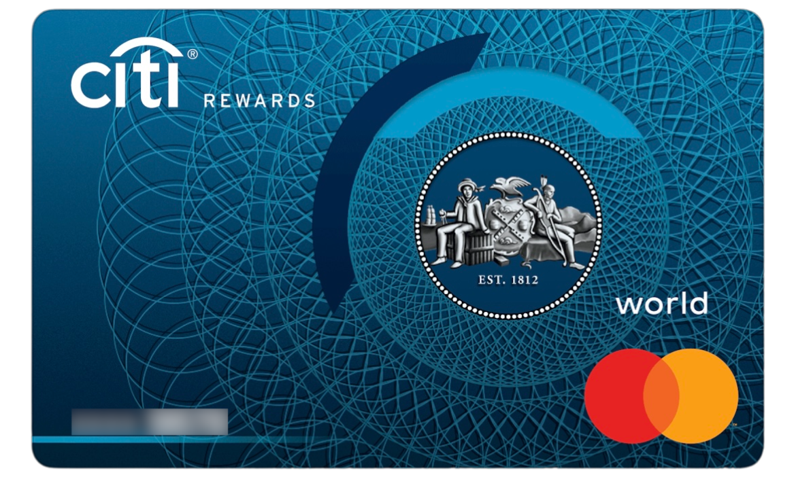

<table>
<tr>
<th colspan="3">外幣交易</th>
<td colspan="2">1.95%</td>
</tr>
</table>
 

<table>
<tr>
<th>消費類別</th>
<th>回贈</th>
<th>限制</th>
<th>方式</th>
<th>結束日</th>
</tr>
<tr>
<td>服飾百貨</td>
<td>8.1X (3%)</td>
<td bgcolor="lightgreen">每月最高額外113,400分▲ (消費$15,971)</td>
<td>不限</td>
<td>31Oct25</td>
</tr>
<tr>
<td colspan="5">MCC 5311 百貨公司 MCC 5611 男裝商店 MCC 5621 女裝商店 MCC 5631 女性飾品商店 MCC 5651 服裝綜合零售店 MCC 5655 運動服飾商店 MCC 5661 鞋店 MCC 5691 成人內衣店 MCC 5699 未列入其他代碼的服飾商店 MCC 5944 鐘錶珠寶及銀器店 MCC 5948 箱包、皮具店 MCC 5977 化妝品店 MCC 5999 未列入其他代碼的專門零售店</td>
</tr>

<tr>
<td>娛樂（戲院樂園門飛）</td>
<td>8.1X (3%)</td>
<td bgcolor="lightgreen">每月最高額外113,400分▲ (消費$15,971)</td>
<td>不限</td>
<td>31Oct25</td>
</tr>
<tr>
<td colspan="5">MCC 4899 有線衛星及其他付費電視廣播服務 MCC 5815 數字商品視聽媒體 MCC 5816 數字商品遊戲 MCC 5817 數字商品軟件應用 MCC 5818 數字商品多類別 MCC 7832 電影院 MCC 7922 舞臺演出服務及票務 MCC 7996 遊樂園 嘉年華 馬戲團</td>
</tr>

<tr>
<td>本地其他</td>
<td>2.7X (1%)</td>
<td bgcolor="lightgreen">每月最高額外113,400分▲ (消費$66,750)</td>
<td>Apple Pay</td>
<td>31Oct25</td>
</tr>
<tr>
<td colspan="5">▲ 合計</td>
</tr>
</table>

  
詳細T&C

	1. <a target="_blank" rel="noopener noreferrer" href="https://www.citibank.com.hk/e-welcome/chinese/credit-cards/rewards/index.htm">https://www.citibank.com.hk/e-welcome/chinese/credit-cards/rewards/index.htm</a> 
	2. <a target="_blank" rel="noopener noreferrer" href="https://www1.citibank.com.hk/chinese/credit-cards/rewards-card">https://www1.citibank.com.hk/chinese/credit-cards/rewards-card</a> 
	3. <a target="_blank" rel="noopener noreferrer" href="https://www.citibank.com.hk/chinese/credit-cards/pdf/rewards-card/faq.pdf">https://www.citibank.com.hk/chinese/credit-cards/pdf/rewards-card/faq.pdf</a> 
	4. <a target="_blank" rel="noopener noreferrer" href="https://www.citibank.com.hk/chinese/credit-cards/pdf/fee-schedule.pdf">https://www.citibank.com.hk/chinese/credit-cards/pdf/fee-schedule.pdf</a> 
	5. <a target="_blank" rel="noopener noreferrer" href="https://www.citibank.com.hk/chinese/credit-cards/pdf/rewards-card/terms-and-conditions.pdf">https://www.citibank.com.hk/chinese/credit-cards/pdf/rewards-card/terms-and-conditions.pdf</a> 
	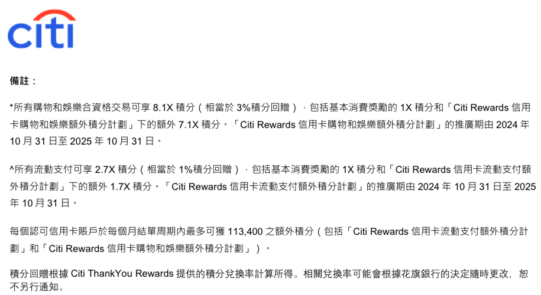 
	 
	 

##### HSBC Visa Gold
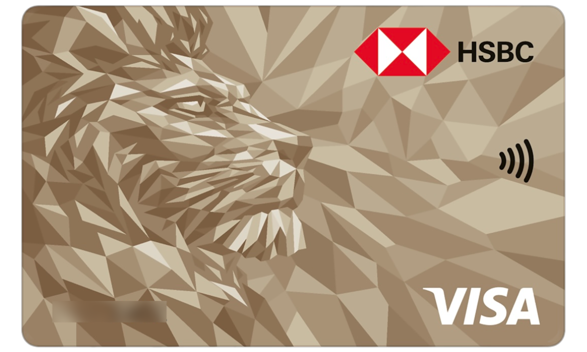

<table>
<tr>
<th colspan="3">任何商戶外幣交易（FCC)</th>
<td colspan="2">1% VS + .95% Bank</td>
</tr>
<tr>
<th colspan="3">海外商戶港幣交易（CBF)</th>
<td colspan="2">1% VS</td>
</tr>
</table>
 

<table>
<tr>
<th>消費類別</th>
<th>回贈</th>
<th>限制</th>
<th>方式</th>
<th>結束日</th>
</tr>
<tr>
<td>賞滋味</td>
<td>6X (2.4%)</td>
<td>每$250計算</td>
<td>不限</td>
<td>31Dec25</td>
</tr>
<tr>
<td colspan="5">餐廳或食肆的香港簽賬 <b>不包括</b>於酒席宴會、私人宴會、包場派對、設於酒店／百貨公司／俱樂部／會所內的飲食專櫃／商戶及其他簽賬類別的指定商戶所提供的餐飲服務的簽賬。</td>
</tr>
</table>

  
詳細T&C

	1. <a target="_blank" rel="noopener noreferrer" href="https://www.redhotoffers.hsbc.com.hk/tc/rewards/red-hot-rewards-of-your-choice/details">https://www.redhotoffers.hsbc.com.hk/tc/rewards/red-hot-rewards-of-your-choice/details</a> 
	2. <a target="_blank" rel="noopener noreferrer" href="https://www.redhotoffers.hsbc.com.hk/media/74309856/TC_TC_2025-RYC.pdf">https://www.redhotoffers.hsbc.com.hk/media/74309856/TC_TC_2025-RYC.pdf</a> 
	3. <a target="_blank" rel="noopener noreferrer" href="https://www.hsbc.com.hk/zh-hk/credit-cards/products/visa-gold/">https://www.hsbc.com.hk/zh-hk/credit-cards/products/visa-gold/</a> 
	4. <a target="_blank" rel="noopener noreferrer" href="https://www.hsbc.com.hk/content/dam/hsbc/hk/docs/credit-cards/key-fact-statement.pdf">https://www.hsbc.com.hk/content/dam/hsbc/hk/docs/credit-cards/key-fact-statement.pdf</a> 
	 
	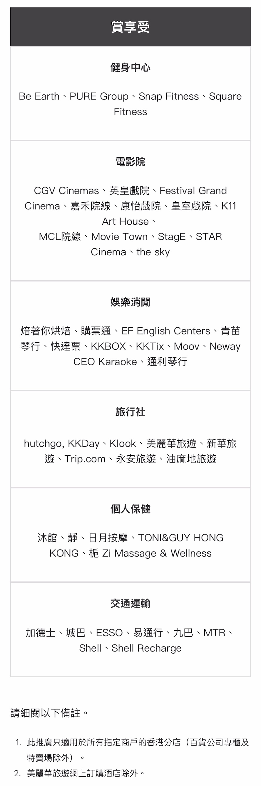 
	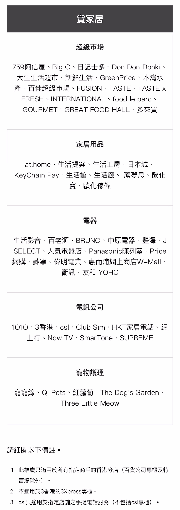 
	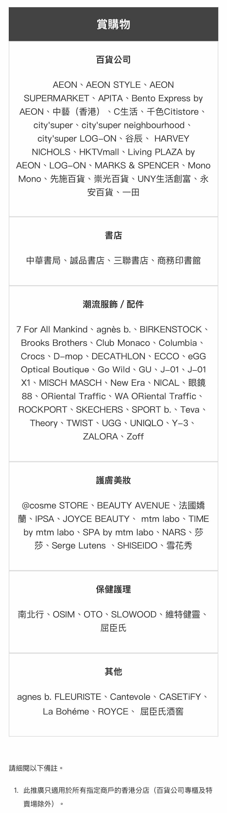 
	 
	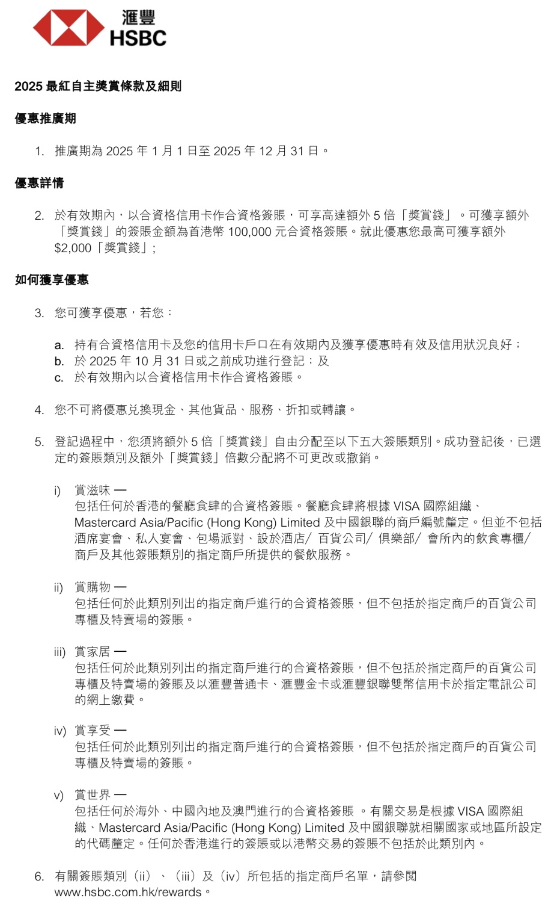 

##### Aeon Wakuwaku

<table>
<tr>
<th colspan="3">任何商戶外幣交易（FCC)</th>
<td colspan="2">1% MC + .95% Bank</td>
</tr>
<tr>
<th colspan="3">海外商戶港幣交易（CBF)</th>
<td colspan="2">1% MC</td>
</tr>
</table>
 

<table>
<tr>
<th>消費類別</th>
<th>回贈</th>
<th>限制</th>
<th>方式</th>
<th>結束日</th>
</tr>

<tr>
<td>網上</td>
<td>6% (.4% + 5.6%)</td>
<td bgcolor="lightgreen">每月合計最高$200▲ (消費$3,571)</td>
<td>不限</td>
<td>28Feb26</td>
</tr>
<tr>
<td colspan="5">於網上以港幣或外幣完成簽賬。 保險交易、以電子錢包之簽賬及AEON商戶免息分期計劃並<b>不計算</b>為此類別合資格簽賬。</td>
</tr>

<tr>
<td>日本</td>
<td>3% (.4% + 2.6%)</td>
<td bgcolor="lightgreen">每月合計最高$200▲ (消費$7,692)</td>
<td>不限</td>
<td>28Feb26</td>
</tr>
<tr>
<td colspan="5">於日本以日元完成簽賬。</td>
</tr>

<tr>
<td>其他</td>
<td>0.4%</td>
<td>無上限</td>
<td>不限</td>
<td>28Feb26</td>
</tr>
<tr>
<td colspan="5">「八達通自動增值」服務金額及八達通增值金額(包括但不限於透過流動支付服務所作之交易)；AEON 商戶免息分期計劃；及保險繳費</td>
</tr>

<tr>
<td colspan="5">每月2號、20號及其他指定日子享感謝日95折優惠。感謝日優惠適用於全線AEON、AEON STYLE、AEON SUPERMARKET及Living PLAZA by AEON。 美食廣場、特許經營商戶及部分指定貨品<b>除外</b></td>
</tr>

<tr>
<td colspan="5">▲ 合計</td>
</tr>
</table>

  
詳細T&C

  	1. <a target="_blank" rel="noopener noreferrer" href="https://www.aeon.com.hk/tc/credit-card/creditcard-wakuwaku.html">https://www.aeon.com.hk/tc/credit-card/creditcard-wakuwaku.html</a>  
    2. <a target="_blank" rel="noopener noreferrer" href="https://www.aeon.com.hk/tc/pdf/credit-card/AEONCARDWAKUWAKU_RBBD_TC.pdf">https://www.aeon.com.hk/tc/pdf/credit-card/AEONCARDWAKUWAKU_RBBD_TC.pdf</a> 
    3. <a target="_blank" rel="noopener noreferrer" href="https://www.aeon.com.hk/tc/useful-info/fee-schedule.html">https://www.aeon.com.hk/tc/useful-info/fee-schedule.html</a> 
	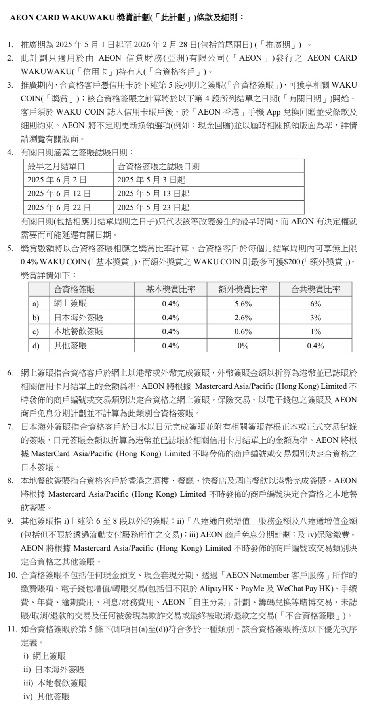 

##### SC Smart
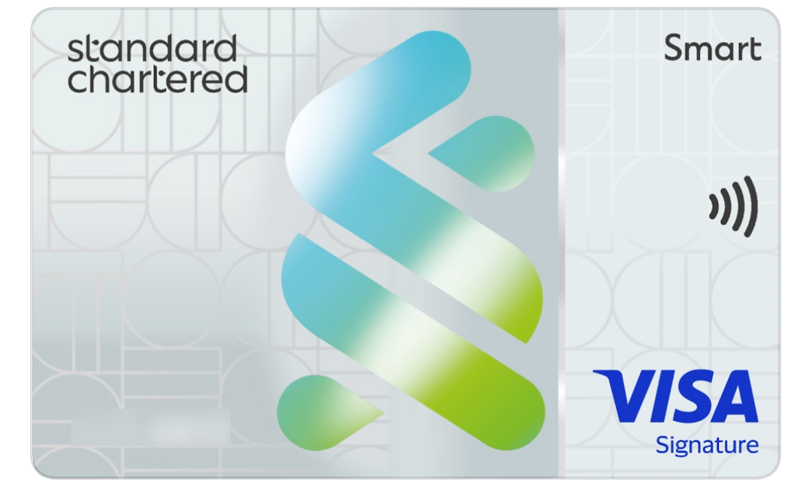

<table>
<tr>
<th colspan="3">任何商戶外幣交易（FCC)</th>
<td colspan="2">0%</td>
</tr>
<tr>
<th colspan="3">海外商戶港幣交易（CBF)</th>
<td colspan="2">0%</td>
</tr>
</table>
 

<table>
<tr>
<th>消費類別</th>
<th>回贈</th>
<th>限制</th>
<th>方式</th>
<th>結束日</th>
</tr>
<tr>
<td rowspan="3">指定</td>
<td>沒有</td>
<td>每月結消費： 未滿$4,000</td>
<td rowspan="3">不限</td>
<td rowspan="3">31Dec25</td>
</tr>
<tr>
<td>5% (4.44% + .56%)</td>
<td bgcolor="lightgreen">每月結消費： $4,000-14,999 4.44% 最高$5,000▲</td>
</tr>
<tr>
<td>5% (3.8% + 1.2%)</td>
<td bgcolor="lightgreen">每月結消費： $15,000或以上 3.8% 最高$5,000▲</td>
</tr>
<tr>
<td colspan="5">
  <ol>
    <li>759阿信屋</li>
    <li>中國移動香港及s/ash.</li>
    <li>OK便利店</li>
    <li>DECATHLON</li>
    <li>HKTVmall</li>
    <li>HK Ticketing 快達票</li>
    <li>日本城零售店和網上商店</li>
    <li>Klook</li>
    <li>香港麥當勞</li>
    <li>Sasa 莎莎香港</li>
    <li>香港百佳指定店舖包括︰百佳超級市場、TASTE、FUSION、INTERNATIONAL、food le parc、GOURMET、GREAT FOOD HALL、便利佳、百佳冷凍食品及百佳網店</li>
    <li>屈臣氏零售店和網上商店</li>
    <li>網上影視串流平台：Amazon Prime Video、Disney+ 、Netflix、 Now TV</li>
    <li>網上音樂串流平台：JOOX 、KKBOX 、MOOV 、Spotify</li>
  </ol>
 </td>
</tr>

<tr>
<td colspan="5">▲ 合計</td>
</tr>
</table>

  
詳細T&C

  	1. <a target="_blank" rel="noopener noreferrer" href="https://www.sc.com/hk/zh/credit-cards/smart/">https://www.sc.com/hk/zh/credit-cards/smart/</a> 
	2. <a target="_blank" rel="noopener noreferrer" href="https://av.sc.com/hk/content/docs/hk-cc-smartcard-kfs.pdf">https://av.sc.com/hk/content/docs/hk-cc-smartcard-kfs.pdf</a> 
	3. <a target="_blank" rel="noopener noreferrer" href="https://av.sc.com/hk/zh/content/docs/hk-promo-smart-tnc.pdf">https://av.sc.com/hk/zh/content/docs/hk-promo-smart-tnc.pdf</a> 
	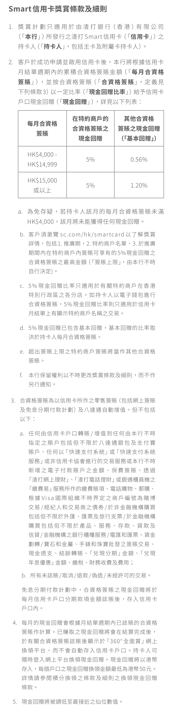 

##### BoC GBA Youth
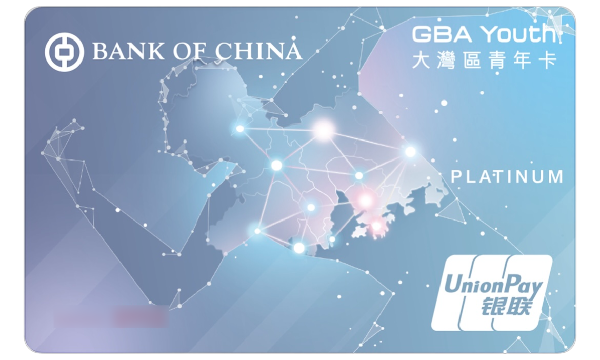

<table>
<tr>
<th colspan="3">任何商戶外幣交易（FCC)</th>
<td colspan="2">1% (人民幣交易除外）</td>
</tr>
<tr>
<th colspan="3">海外商戶港幣交易（CBF)</th>
<td colspan="2">0%</td>
</tr>
</table>
 

<table>
<tr>
<th colspan="5">迎新</th>
</tr>
<tr>
<td>手機簽賬</td>
<td>10%</td>
<td>最高$300 (消費$3,000)</td>
<td>Apple Pay、雲閃付App QR主/被掃</td>
<td>31Jul25</td>
</tr>
<tr>
<td colspan="5">持卡人之港幣及人民幣賬戶簽賬將合併計算（如適用），而每1元人民幣簽賬將當作港幣1 元計算。 除特別註明外，合資格的海外零售簽賬需以外幣交易及支付，以港幣支付的外幣簽賬並不包括在內。  於發卡當月起的其後四個曆月內誌入。</td>
</tr>
</table>

<table>
<tr>
<th>消費類別</th>
<th>回贈</th>
<th>限制</th>
<th>方式</th>
<th>結束日</th>
</tr>

<tr>
<td>中港澳</td>
<td>5%</td>
<td>每曆月最高$100 (消費$2,000)</td>
<td>不限</td>
<td>31Dec25</td>
</tr>
<tr>
<td colspan="5">每RMB¥1簽賬將當作HK$1計算。  <b>不包括</b>所有網上簽賬、透過AlipayHK及WeChat Pay HK所作之簽賬、網上支付系統繳費予指定商戶(包括但不限於PayPal或支付寶)、透過流動裝置/應用程序/電子轉賬平台進行個人對個人(P2P)的現金轉賬。</td>
</tr>
</table>

  
詳細T&C

  	1. <a target="_blank" rel="noopener noreferrer" href="https://www.bochk.com/m/tc/creditcard/details/cobrand/cobrand/gbayouth.html">https://www.bochk.com/m/tc/creditcard/details/cobrand/cobrand/gbayouth.html</a> 
  	2. <a target="_blank" rel="noopener noreferrer" href="https://www.bochk.com/creditcard/bocci/agt/key_facts_statement_chi.pdf">https://www.bochk.com/creditcard/bocci/agt/key_facts_statement_chi.pdf</a> 
	3. <a target="_blank" rel="noopener noreferrer" href="https://www.bochk.com/dam/boccreditcard/cbc_pdf/gba_product_tnc_tc.pdf">https://www.bochk.com/dam/boccreditcard/cbc_pdf/gba_product_tnc_tc.pdf</a> 
	4. <a target="_blank" rel="noopener noreferrer" href="https://m.unionpayintl.com/hk/servicesProducts/serviceEquity/Great_Bay_Area_Transit/">https://m.unionpayintl.com/hk/servicesProducts/serviceEquity/Great_Bay_Area_Transit/</a> 
	5. <a target="_blank" rel="noopener noreferrer" href="https://docs.google.com/spreadsheets/d/1z799lhfggPRTZfQDEu9uO97qS6EVv2_Xr6Rp1xIvOS8/htmlview">https://docs.google.com/spreadsheets/d/1z799lhfggPRTZfQDEu9uO97qS6EVv2_Xr6Rp1xIvOS8/htmlview</a>  
	6. 迎新 <a target="_blank" rel="noopener noreferrer" href="https://www.bochk.com/dam/boccreditcard/cbc_pdf/gba_welcome_tnc.pdf">https://www.bochk.com/dam/boccreditcard/cbc_pdf/gba_welcome_tnc.pdf</a>  
	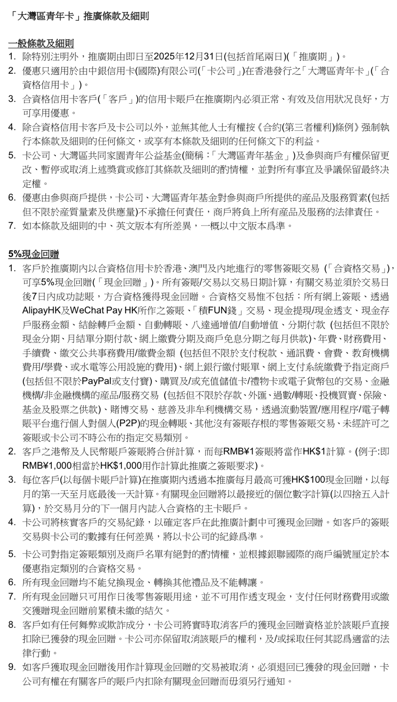 

##### 查看即時匯率

<ol>
  <li><a target="_blank" rel="noopener noreferrer" href="https://www.mastercard.us/en-us/personal/get-support/convert-currency.html">Mastercard</a></li>
  <li><a target="_blank" rel="noopener noreferrer" href="https://www.visa.com.hk/zh_HK/support/consumer/travel-support/exchange-rate-calculator.html">Visa</a></li>
  <li><a target="_blank" rel="noopener noreferrer" href="https://m.unionpayintl.com/hk/rate/">UnionPay</a></li>
</ol>