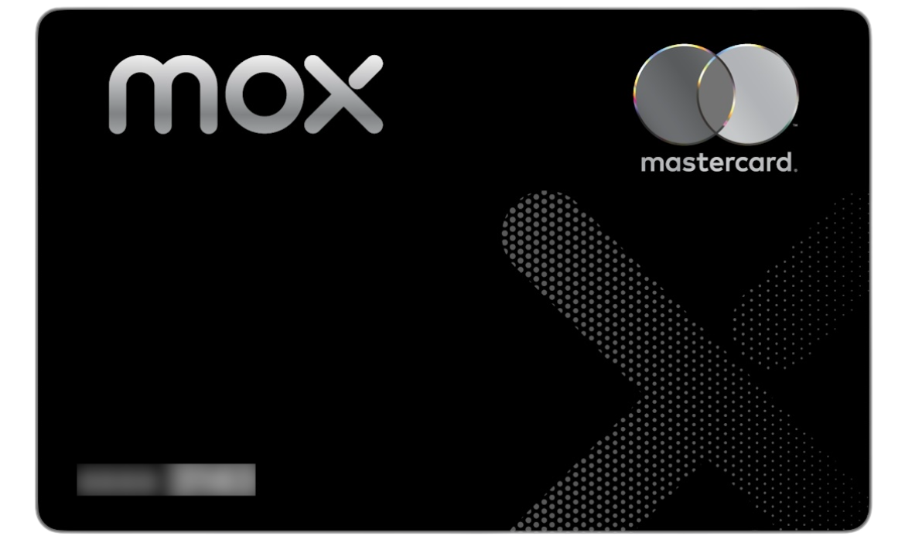
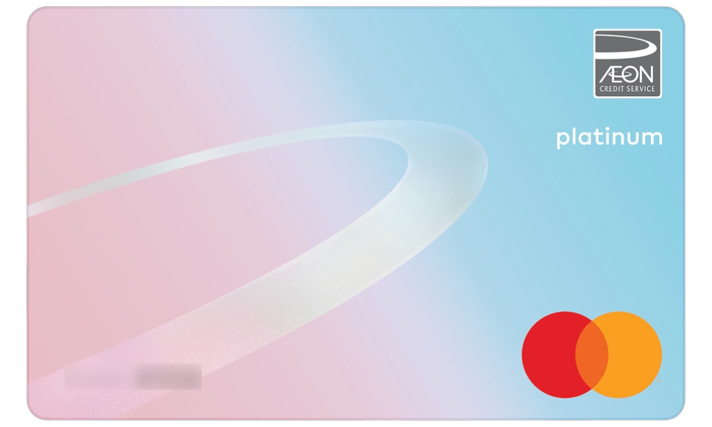
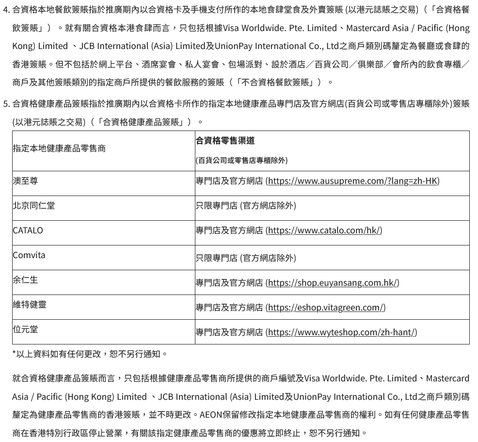

### 信用卡日常消費優惠
##### 更新日期：18Nov2024

#### 卡
<a href="#mox">Mox Credit</a> 
<a href="#citi">Citi Rewards</a> 
<a href="#hsbc">HSBC Visa Gold</a> 
<a href="#aeon">Aeon Wakuwaku</a> 
<a href="#sc">SC Smart</a> 

##### Mox Credit

<table>
<tr>
<th>消費類別</th>
<th>回贈</th>
<th>限制</th>
<th>方式</th>
<th>結束日</th>
</tr>
<tr>
<td>超市</td>
<td>3%</td>
<td>無上限</td>
<td>不限</td>
<td>n/a</td>
</tr>
</table>

  
詳細T&C

	1. https://mox.com/zh/promotions/unlimitedcashback/
	<iframe src="https://mox.com/zh/promotions/unlimitedcashback/"></iframe>
	
	
	

##### Citi Rewards

<table>
<tr>
<th>消費類別</th>
<th>回贈</th>
<th>限制</th>
<th>方式</th>
<th>結束日</th>
</tr>
<tr>
<td>服飾百貨</td>
<td>8.1X (3%)</td>
<td rowspan="2">每月最高額外113400分 (消費$15,971)</td>
<td rowspan="2">不限</td>
<td rowspan="3">30Apr25</td>
</tr>
<tr>
<td>娛樂（戲院樂園門飛）</td>
<td>8.1X (3%)</td>
</tr>
<tr>
<td>本地其他</td>
<td>2.7X (1%)</td>
<td>每月最高額外113400分 (消費$66,750)</td>
<td>不限</td>
</tr>
</table>

  
詳細T&C

	1. https://www.citibank.com.hk/e-welcome/chinese/credit-cards/rewards/index.htm
	<iframe src="https://www.citibank.com.hk/e-welcome/chinese/credit-cards/rewards/index.htm"></iframe>
	
	2. https://www1.citibank.com.hk/chinese/credit-cards/rewards-card
	<iframe src="https://www1.citibank.com.hk/chinese/credit-cards/rewards-card"></iframe>
	
	3. https://www.citibank.com.hk/chinese/credit-cards/pdf/rewards-card/faq.pdf
	<iframe src="https://www.citibank.com.hk/chinese/credit-cards/pdf/rewards-card/faq.pdf"></iframe>
	
	
	
	
	

##### HSBC Visa Gold

<table>
<tr>
<th>消費類別</th>
<th>回贈</th>
<th>限制</th>
<th>方式</th>
<th>結束日</th>
</tr>
<tr>
<td>飲食</td>
<td>6X (2.4%)</td>
<td>每$250計算</td>
<td>不限</td>
<td>31Dec24</td>
</tr>
</table>

  
詳細T&C

	1. https://www.redhotoffers.hsbc.com.hk/tc/rewards/red-hot-rewards-of-your-choice/details
	<iframe src="https://www.redhotoffers.hsbc.com.hk/tc/rewards/red-hot-rewards-of-your-choice/details"></iframe>
	
	
	

##### Aeon Wakuwaku

<table>
<tr>
<th>消費類別</th>
<th>回贈</th>
<th>限制</th>
<th>方式</th>
<th>結束日</th>
</tr>
<tr>
<td>飲食</td>
<td>4%</td>
<td>每月最高$100 (消費$2,500)</td>
<td>Apple Pay</td>
<td>28Feb25</td>
</tr>
<tr>
<td>網上</td>
<td>6%</td>
<td>每月合計最高$300 (單類別消費$5,000)</td>
<td>不限</td>
<td rowspan="2">30Apr25</td>
</tr>
<tr>
<td>日本</td>
<td>3%</td>
<td>每月合計最高$300 (單類別消費$10,000)</td>
<td>不限</td>
</tr>
<tr>
<td>手續費</td>
<td>0.95/1/1.95%</td>
<td>無上限</td>
<td>不限</td>
<td>28Feb25</td>
</tr>
</table>

  
詳細T&C

	1. https://www.aeon.com.hk/tc/credit-card/creditcard-wakuwaku.html
	<iframe src="https://www.aeon.com.hk/tc/credit-card/creditcard-wakuwaku.html"></iframe>
	
	2. https://www.aeon.com.hk/tc/pdf/credit-card/AEONCARDWAKUWAKU_RBBD_TC.pdf
	<iframe src="<iframe src="https://www.aeon.com.hk/tc/credit-card/creditcard-wakuwaku.html"></iframe>"></iframe>
	
	
	
	「賞」食
	3. https://www.aeon.com.hk/tc/privilege/promotion_fnb_0324.html
	<iframe src="<iframe src="https://www.aeon.com.hk/tc/privilege/promotion_fnb_0324.html"></iframe>"></iframe>
	
	
	
	

	海外簽賬手續費無上限回贈
	4. https://www.aeon.com.hk/tc/privilege/promotion_ftf_1124.html
	<iframe src="<iframe src="https://www.aeon.com.hk/tc/privilege/promotion_ftf_1124.html"></iframe>"></iframe>
	
	5. https://www.aeon.com.hk/tc/pdf/promotion/AEON_Card_ForeignTransactionFee_Unlimited%20Cash%20Rebate_Reward%20_Calculation_Examples.pdf
	<iframe src="<iframe src="https://www.aeon.com.hk/tc/pdf/promotion/AEON_Card_ForeignTransactionFee_Unlimited%20Cash%20Rebate_Reward%20_Calculation_Examples.pdf"></iframe>"></iframe>

	
	

##### SC Smart

<table>
<tr>
<th>消費類別</th>
<th>回贈</th>
<th>限制</th>
<th>方式</th>
<th>結束日</th>
</tr>
<tr>
<td>指定</td>
<td>5%</td>
<td>每月最高$3,000 (消費$60,000)</td>
<td>不限</td>
<td>31Dec24</td>
</tr>
</table>

  
詳細T&C

	1. https://www.sc.com/hk/zh/credit-cards/smart/
	<iframe src="https://www.sc.com/hk/zh/credit-cards/smart/"></iframe>
	
	2. https://av.sc.com/hk/zh/content/docs/hk-promo-smart-tnc.pdf
	<iframe src="https://av.sc.com/hk/zh/content/docs/hk-promo-smart-tnc.pdf"></iframe>
	
	
	
	
	迎新
	3. https://av.sc.com/hk/content/docs/hk-cc-tncs-downloadnow.pdf
	<iframe src="https://av.sc.com/hk/content/docs/hk-cc-tncs-downloadnow.pdf"></iframe>
	
	
	

