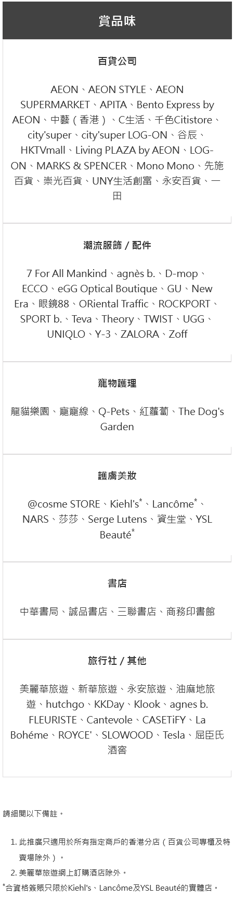

#### 卡
<a href="#mox">Mox Credit</a> 
<a href="#citi">Citi Rewards</a> 
<a href="#hsbc">HSBC Visa Gold</a> 
<a href="#aeon">Aeon Wakuwaku</a> 
<a href="#sc">SC Smart</a> 
  

##### Mox Credit

<table>
<tr>
<th>消費類別</th>
<th>回贈</th>
<th>限制</th>
<th>方式</th>
<th>結束日</th>
</tr>
<tr>
<td>超市</td>
<td>3%</td>
<td>無上限</td>
<td>不限</td>
<td>n/a</td>
</tr>
<tr>
<td colspan="5">馬莎百貨 一田 3hreeSixty PNS網購 Market Place HKTVmall city'super 惠康 TASTE 百佳超級市場 FUSION 更多場級市場...</td>
</tr>
</table>

  
詳細T&C

	1. <a target="_blank" rel="noopener noreferrer" href="https://mox.com/zh/promotions/unlimitedcashback/">https://mox.com/zh/promotions/unlimitedcashback/</a> 
	
	 
	 

##### Citi Rewards

<table>
<tr>
<th>消費類別</th>
<th>回贈</th>
<th>限制</th>
<th>方式</th>
<th>結束日</th>
</tr>
<tr>
<td>服飾百貨</td>
<td>8.1X (3%)</td>
<td>每月最高額外113400分▲ (消費$15,971)</td>
<td>不限</td>
<td>30Apr25</td>
</tr>
<tr>
<td colspan="5">MCC 5311 百貨公司 MCC 5611 男裝商店 MCC 5621 女裝商店 MCC 5631 女性飾品商店 MCC 5651 服裝綜合零售店 MCC 5655 運動服飾商店 MCC 5661 鞋店 MCC 5691 成人內衣店 MCC 5699 未列入其他代碼的服飾商店 MCC 5944 鐘錶珠寶及銀器店 MCC 5948 箱包、皮具店 MCC 5977 化妝品店 MCC 5999 未列入其他代碼的專門零售店</td>
</tr>

<tr>
<td>娛樂（戲院樂園門飛）</td>
<td>8.1X (3%)</td>
<td>每月最高額外113400分▲ (消費$15,971)</td>
<td>不限</td>
<td>30Apr25</td>
</tr>
<tr>
<td colspan="5">MCC 4899 有線衛星及其他付費電視廣播服務 MCC 5815 數字商品視聽媒體 MCC 5816 數字商品遊戲 MCC 5817 數字商品軟件應用 MCC 5818 數字商品多類別 MCC 7832 電影院 MCC 7922 舞臺演出服務及票務 MCC 7996 遊樂園 嘉年華 馬戲團</td>
</tr>

<tr>
<td>本地其他</td>
<td>2.7X (1%)</td>
<td>每月最高額外113400分▲ (消費$66,750)</td>
<td>不限</td>
<td>30Apr25</td>
</tr>
<tr>
<td colspan="5">▲ 合計</td>
</tr>
</table>

  
詳細T&C

	1. <a target="_blank" rel="noopener noreferrer" href="https://www.citibank.com.hk/e-welcome/chinese/credit-cards/rewards/index.htm">https://www.citibank.com.hk/e-welcome/chinese/credit-cards/rewards/index.htm</a> 
	
	2. <a target="_blank" rel="noopener noreferrer" href="https://www1.citibank.com.hk/chinese/credit-cards/rewards-card">https://www1.citibank.com.hk/chinese/credit-cards/rewards-card</a> 

	3. <a target="_blank" rel="noopener noreferrer" href="https://www.citibank.com.hk/chinese/credit-cards/pdf/rewards-card/faq.pdf">https://www.citibank.com.hk/chinese/credit-cards/pdf/rewards-card/faq.pdf</a> 
	
	 
	 
	 
	 

##### HSBC Visa Gold

<table>
<tr>
<th>消費類別</th>
<th>回贈</th>
<th>限制</th>
<th>方式</th>
<th>結束日</th>
</tr>
<tr>
<td>賞滋味</td>
<td>6X (2.4%)</td>
<td>每$250計算</td>
<td>不限</td>
<td>31Dec24</td>
</tr>
<tr>
<td colspan="5">餐廳或食肆的香港簽賬 <b>不包括</b>於酒席宴會、私人宴會、包場派對、設於酒店／百貨公司／俱樂部／會所內的飲食專櫃／商戶及其他簽賬類別的指定商戶所提供的餐飲服務的簽賬。</td>
</tr>
</table>

  
詳細T&C

	1. <a target="_blank" rel="noopener noreferrer" href="https://www.redhotoffers.hsbc.com.hk/tc/rewards/red-hot-rewards-of-your-choice/details">https://www.redhotoffers.hsbc.com.hk/tc/rewards/red-hot-rewards-of-your-choice/details</a> 

	 
	 
	 
	 
	 
	 
	 
	 

##### Aeon Wakuwaku

<table>
<tr>
<th>消費類別</th>
<th>回贈</th>
<th>限制</th>
<th>方式</th>
<th>結束日</th>
</tr>
<tr>
<td>飲食</td>
<td>4%</td>
<td>每月最高$100 (消費$2,500)</td>
<td>Apple Pay</td>
<td>28Feb25</td>
</tr>
<tr>
<td colspan="5">於香港之酒樓、餐廳、快餐店及酒店餐飲以港幣完成簽賬。本地食肆堂食及外賣簽賬 (以港元誌賬之交易) <b>不包括</b>於網上平台、酒席宴會、私人宴會、包場派對、設於酒店／百貨公司／俱樂部／會所內的飲食專櫃／商戶及其他簽賬類別的指定商戶所提供的餐飲服務的簽賬。</td>
</tr>

<tr>
<td>網上</td>
<td>6%</td>
<td>每月合計最高$300▲ (消費$5,000)</td>
<td>不限</td>
<td>30Apr25</td>
</tr>
<tr>
<td colspan="5">網上以港幣或外幣完成簽賬，外幣簽賬金額以折算為港幣並已誌賬於相關信用卡月結單上的金額爲準。 <b>不計算</b>以電子錢包內信用卡所作之網上簽賬。</td>
</tr>

<tr>
<td>日本</td>
<td>3%</td>
<td>每月合計最高$300▲ (消費$10,000)</td>
<td>不限</td>
<td>30Apr25</td>
</tr>
<tr>
<td colspan="5">於日本以日元完成簽賬。</td>
</tr>

<tr>
<td>外幣手續費</td>
<td>海外0.95/ 本地1.95%</td>
<td>無上限</td>
<td>不限</td>
<td>28Feb25</td>
</tr>
<tr>
<td colspan="5">海外簽賬包括外幣交易及以港幣支付的海外或非香港登記商戶交易。</td>
</tr>

<tr>
<td colspan="5">▲ 合計</td>
</tr>
</table>

  
詳細T&C

  	1. <a target="_blank" rel="noopener noreferrer" href="https://www.aeon.com.hk/tc/credit-card/creditcard-wakuwaku.html">https://www.aeon.com.hk/tc/credit-card/creditcard-wakuwaku.html</a> 
   
    2. <a target="_blank" rel="noopener noreferrer" href="https://www.aeon.com.hk/tc/pdf/credit-card/AEONCARDWAKUWAKU_RBBD_TC.pdf">https://www.aeon.com.hk/tc/pdf/credit-card/AEONCARDWAKUWAKU_RBBD_TC.pdf</a> 
	
	 
	 
	 
	 
	
	「賞」食 
	3. <a target="_blank" rel="noopener noreferrer" href="https://www.aeon.com.hk/tc/privilege/promotion_fnb_0324.html">https://www.aeon.com.hk/tc/privilege/promotion_fnb_0324.html</a> 
	
	 
	 
	 

	海外簽賬手續費無上限回贈 
	4. <a target="_blank" rel="noopener noreferrer" href="https://www.aeon.com.hk/tc/privilege/promotion_ftf_1124.html">https://www.aeon.com.hk/tc/privilege/promotion_ftf_1124.html</a> 
	
	5. <a target="_blank" rel="noopener noreferrer" href="https://www.aeon.com.hk/tc/pdf/promotion/AEON_Card_ForeignTransactionFee_Unlimited%20Cash%20Rebate_Reward%20_Calculation_Examples.pdf">https://www.aeon.com.hk/tc/pdf/promotion/AEON_Card_ForeignTransactionFee_Unlimited%20Cash%20Rebate_Reward%20_Calculation_Examples.pdf</a> 

	 
	 

##### SC Smart

<table>
<tr>
<th>消費類別</th>
<th>回贈</th>
<th>限制</th>
<th>方式</th>
<th>結束日</th>
</tr>
<tr>
<td>指定</td>
<td>5%</td>
<td>每月最高$3,000 (消費$60,000)</td>
<td>不限</td>
<td>31Dec24</td>
</tr>
<tr>
<td colspan="5">生活用品:759阿信屋、香港百佳、OK便利店、HKTVmall、日本城  護膚保健︰香港莎莎、屈臣氏  數碼生活︰中國移動香港及s/ash  餐飲︰戶戶送、Häagen-Dazs™、麥當勞®及麥當勞App  運動消閒︰DECATHLON、Klook、快達票 HK Ticketing  網上影視串流平台：Amazon Prime Video、Disney+ 、Netflix、 Now TV  網上音樂串流平台：JOOX 、KKBOX 、MOOV 、Spotify</td>
</tr>
</table>

  
詳細T&C

  	1. <a target="_blank" rel="noopener noreferrer" href="https://www.sc.com/hk/zh/credit-cards/smart/">https://www.sc.com/hk/zh/credit-cards/smart/</a> 
  
	2. <a target="_blank" rel="noopener noreferrer" href="https://av.sc.com/hk/zh/content/docs/hk-promo-smart-tnc.pdf">https://av.sc.com/hk/zh/content/docs/hk-promo-smart-tnc.pdf</a> 
  
	 
	 
	
	迎新 
	3. <a target="_blank" rel="noopener noreferrer" href="https://av.sc.com/hk/content/docs/hk-cc-tncs-downloadnow.pdf">https://av.sc.com/hk/content/docs/hk-cc-tncs-downloadnow.pdf</a> 
	
	 
	 

